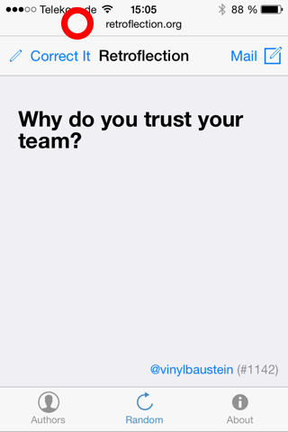
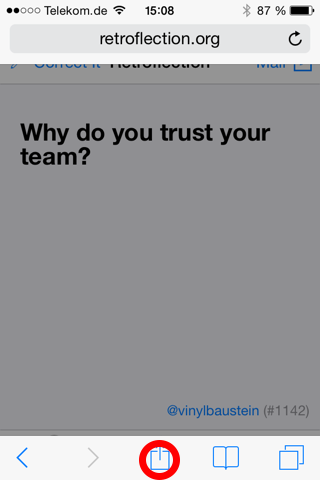
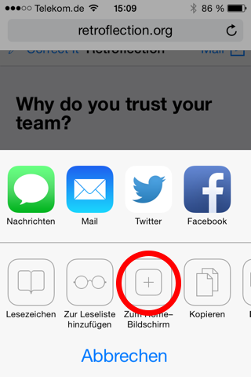

Retroflection, formerly AgileRetroflection
==========================================

This is the master folder for the Retroflection of the day App.

To experience the currently deployed version, visit [retroflection.org](http://retroflection.org)

The app is designed to run on mobile phones and depends on javascript and HTML5. It can also be run without an internet
connection once it has been loaded to the phone. It will be completely cached by your phone, so updating can be a little bit tidious. 
Be sure to completely delete your caches and saved data on the phone. To install it as an app, do the following:

### iPhone (iOS 7)

1. Open [retroflection.org](http://retroflection.org) in Safari.
1. Click on the title to open the bottom menu of Safari. See Image 1 below.
1. Click the "share" symbol. See Image 2 below.
1. Then choose the option with the "+" symbol. Probably your phone won't be in German. See Image 3 below.
1. The app's icon looks different now. But you will notice that.
1. IMPORTANT: If you have had the app installed previously, you must delete it first.

  

### Android

Unfortunately I can't help here. Feel free to edit this text.

