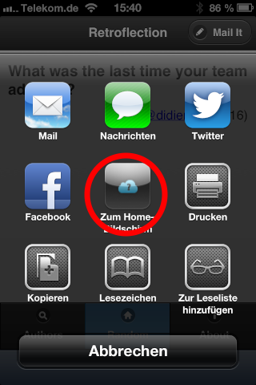

Retroflection, formerly AgileRetroflection
==========================================

This is the master folder for the Retroflection of the day App.

To experience the currently deployed version, visit [retroflection.org](http://retroflection.org)

The app is designed to run on mobile phones and depends on javascript and HTML5. It can also be run without an internet connection once it has been loaded to the phone. To install it as an app, do the following:

### iPhone

1. Open [retroflection.org](http://retroflection.org) in Safari.
1. Find the "forward" button on the bottom. See Image 1 below.
1. Then choose the option in the middle. Probably your phone qon't be in German. See Image 2 below.
1. If you have had the app installed previously, you must delete it first.

 

### Android

Unfortunately I can't help here. Feel free to edit this text.

Updating questions in github
============================

1. create a github account and follow [these instructions](https://help.github.com/articles/set-up-git)
1. fork the project according to [these instructions](https://help.github.com/articles/fork-a-repo)
1. change the question you want inside the folder "questionstore"
1. commit and push your changes like [there](https://help.github.com/articles/fork-a-repo)
1. set up a pull-request, also described [there](https://help.github.com/articles/fork-a-repo)
1. do not forget to update the original spreadsheet

